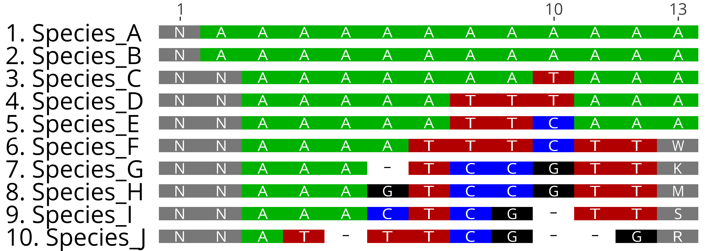

.. _getAlignmentBreakdown:

##########################
**getAlignmentBreakdown**
##########################

*getAlignmentBreakdown* returns the species IDs from an alignment file, specified by *alignment_path*

.. warning::
  
  **Note:** Rboretum currently does not support handling of degenerate bases, and classifies them broadly as N/missing. Support for degenerate nucleotides is in progress and set for a future release. 

=======================
Function and Arguments
=======================

**Usage**:
::

  getAlignmentBreakdown <- function(alignment_path,species_info,use_gaps,alignment_name,prefix,suffix)

===========================      ===============================================================================================================================================================================================================
 Argument                         Description
===========================      ===============================================================================================================================================================================================================
**alignment_path**				        An absolute or relative path to an alignment file(s) or a directory containing multiple alignments
**species_info**                  A list of species to consider, provided as a phylo, multiPhlyo, character vector or labels or a semicolon-delimited string [Default: Shared species among all alignments]
**use_gaps**                      If FALSE, consider gaps (-) in alignments as missing data. [Default: TRUE, treat gaps as indel characters]
**alignment_name**                A character vector containing desired alignment IDs [Default: Derive name from filename]
**prefix**                        If **alignment_path** points to a directory, only query files starting with **prefix** (e.g. 'Alignment') [Default: Use all files in directory]
**suffix**                        If **alignment_path** points to a directory, only query files ending wtih **suffix** (e.g. '.nex') [Default: Use all files in directory]
===========================      ===============================================================================================================================================================================================================

==============
Example Usage
==============

.. code-block:: r
  
  # Script: Rboretum/docs/content/Doc_Function_Scripts/getAlignmentBreakdown.R

  library(Rboretum)
  sourceRboretum()
  
  # Get alignment Breakdown information for a single alignment
  getAlignmentBreakdown(alignment_path = rb_align1_path)

    Alignment_Name Alignment_Length Alignment_Percent_GC Percent_Degenerate  Percent_N Percent_Gap Species_GC_Mean Species_GC_StdDev Percent_Nonbase Percent_Invariant Percent_Singleton Percent_Parsimony_Informative
  1     Gene_1.phy             1551            0.3982911                  0 0.02677842  0.03249516       0.3982685       0.006593726               0         0.7176015         0.1476467                     0.1263701
    Percent_Biallelic Percent_Triallelic Percent_Quadallelic Percent_Pentallelic
  1         0.1289491        0.005802708                   0                   0

  # Get alignment Breakdown information from all .phy files in a directory, providing new names, consider gaps as missing data
  getAlignmentBreakdown(alignment_path = rb_alignment_dir,use_gaps = FALSE,suffix = ".phy",alignment_name = c('Gene_A','Gene_B','Gene_C','Gene_D','Gene_E'))

    Alignment_Name Alignment_Length Alignment_Percent_GC Percent_Degenerate  Percent_N Percent_Gap Species_GC_Mean Species_GC_StdDev Percent_Nonbase Percent_Invariant Percent_Singleton Percent_Parsimony_Informative
  1         Gene_A             1551            0.3982911                  0 0.02677842  0.03249516       0.3982685       0.006593726      0.02707930         0.7504836         0.1121857                     0.1044487
  2         Gene_B             2804            0.5219202                  0 0.02691393  0.10537328       0.5219258       0.002919946      0.09486448         0.4925107         0.2014979                     0.1690442
  3         Gene_C             1031            0.5919662                  0 0.02644682  0.27009376       0.5919771       0.009096305      0.23957323         0.2580019         0.2085354                     0.2279340
  4         Gene_D             2219            0.4160601                  0 0.02679886  0.09397627       0.4160605       0.005487643      0.07706174         0.4173051         0.2158630                     0.2532672
  5         Gene_E             1500            0.4895705                  0 0.02626667  0.00000000       0.4895817       0.006269950      0.00000000         0.5713333         0.1900000                     0.2006667
    Percent_Biallelic Percent_Triallelic Percent_Quadallelic Percent_Pentallelic
  1         0.1057382        0.004513217        0.0000000000                   0
  2         0.1990014        0.012125535        0.0000000000                   0
  3         0.2638215        0.030067895        0.0000000000                   0
  4         0.2685895        0.020730059        0.0004506534                   0
  5         0.2240000        0.014666667        0.0000000000                   0
  
  # Get alignment Breakdown information from all .phy files in a directory, providing new names, consider gaps as indel data, and only analyze species A-E
  getAlignmentBreakdown(alignment_path = rb_alignment_dir,species_info = 'Species_A;Species_B;Species_C;Species_D;Species_E',use_gaps = TRUE,suffix = ".phy",alignment_name = c('Gene_A','Gene_B','Gene_C','Gene_D','Gene_E'))
  
  # Get alignment Breakdown from dummy alignment, with and without gap support
  getAlignmentBreakdown(alignment_path = rb_dummy_align_path)

        Alignment_Name Alignment_Length Alignment_Percent_GC Percent_Degenerate Percent_N Percent_Gap Species_GC_Mean Species_GC_StdDev Percent_Nonbase Percent_Invariant Percent_Singleton Percent_Parsimony_Informative
  1 Dummy_Alignment.fa               13            0.1470588         0.03846154 0.1384615  0.03846154       0.1686147         0.1825288       0.1538462         0.1538462         0.2307692                     0.3076923
    Percent_Biallelic Percent_Triallelic Percent_Quadallelic Percent_Pentallelic
  1         0.2307692         0.07692308          0.07692308          0.07692308

  getAlignmentBreakdown(alignment_path = rb_dummy_align_path,use_gaps = FALSE)

        Alignment_Name Alignment_Length Alignment_Percent_GC Percent_Degenerate Percent_N Percent_Gap Species_GC_Mean Species_GC_StdDev Percent_Nonbase Percent_Invariant Percent_Singleton Percent_Parsimony_Informative
  1 Dummy_Alignment.fa               13            0.1470588         0.03846154 0.1384615  0.03846154       0.1686147         0.1825288       0.1538462         0.2307692         0.1538462                     0.3846154
    Percent_Biallelic Percent_Triallelic Percent_Quadallelic Percent_Pentallelic
  1         0.2307692         0.07692308           0.1538462                   0

**Dummy Alignment**

