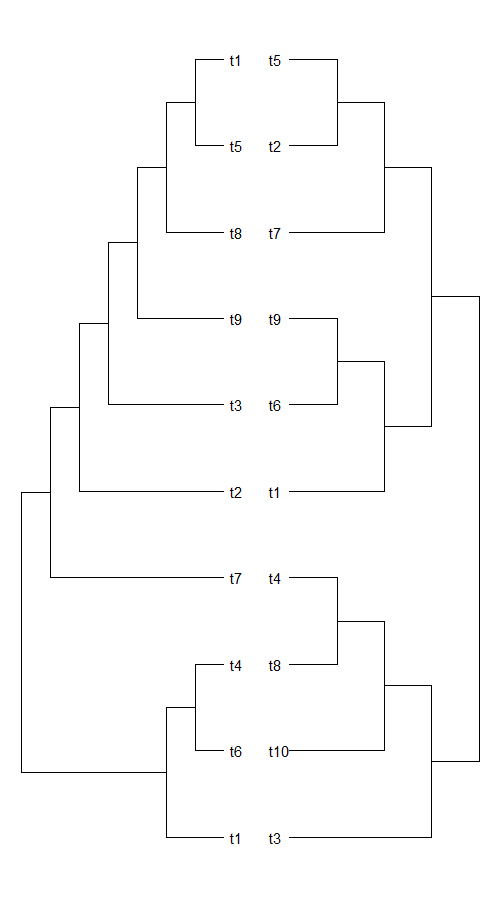
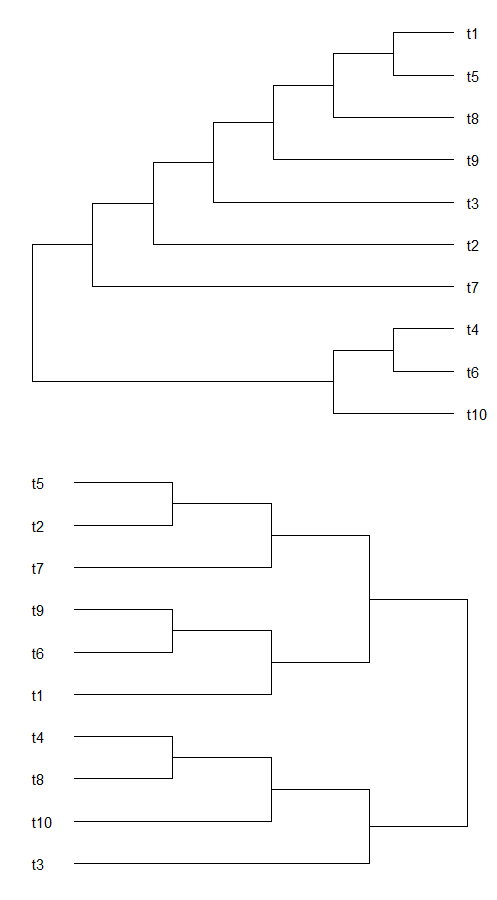
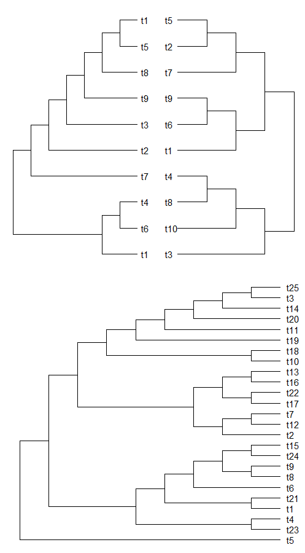

.. _tandemPlotter:

##################
**tandemPlotter**
##################

*tandemPlotter* calls ggdraw, and is a quick way to look at multiple plots.

=======================
Function and Arguments
=======================

**Usage**:
::

  tandemPlotter(plots,vertical)

===========================      ===============================================================================================================================================================================================================
 Argument                         Description
===========================      ===============================================================================================================================================================================================================
**plots**				                  Multiple ggplot objects specified separately, or a list of ggplot objects
**vertical**                      If TRUE, combine plots vertically [Defualt: FALSE, combine horizontally]
===========================      ===============================================================================================================================================================================================================

==============
Example Usage
==============

.. code-block:: r
  
  # Script: Rboretum/docs/content/Doc_Function_Scripts/tandemPlotter.R
  
  library(Rboretum)
  
  plot_1 <- ggtree(ape::rtree(10),branch.length = 'none') + geom_tiplab(offset=.2)
  plot_2 <- ggtree(ape::rtree(10),branch.length = 'none') + geom_tiplab(offset=-.4) + scale_x_reverse()
  plot_3 <- ggtree(ape::rtree(25),branch.length = 'none') + geom_tiplab(offset=.2)
  
  tandemPlotter(plot_1,plot_2)
  tandemPlotter(plot_1,plot_2,vertical = TRUE)
  tandemPlotter(tandemPlotter(plot_1,plot_2),plot_3,vertical = TRUE)

  

  
