.. _treePlotter:

################
**treePlotter**
################
.. |br| raw:: html

    

This is a walkthrough for the Rboretum Tree Plotter. **treePlotter** is a wrapper for the *ggtree* function, and it adds many user-friendly customization options. 

===============
Basic Plotting
===============

To get started, let's read in one tree.

.. code-block:: r

  myTree <- readRooted(rb_tree1_path,'Species_C;Species_H')

|br|
If we run treePlotter(myTree), we can see the default settings. 

.. code-block:: r

  treePlotter(myTree)

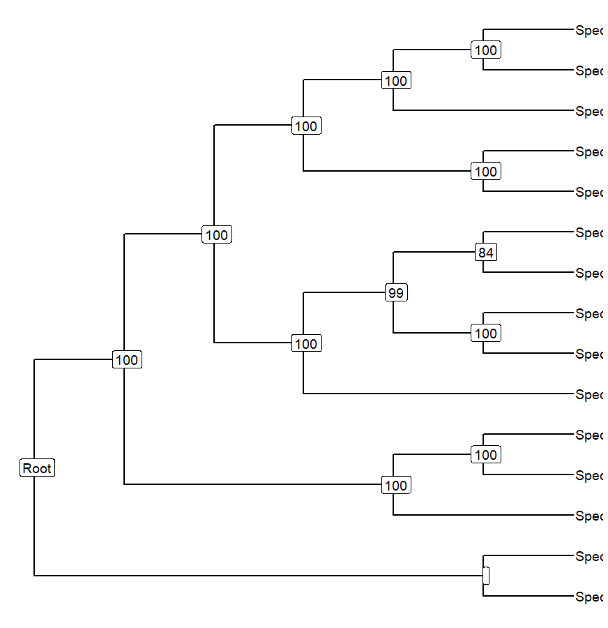

D'oh! Don't you hate it when that happens? **treePlotter** allows you to adjust the *xmin* and *xmax* of plots to help with cut-off labels.

.. code-block:: r

  treePlotter(myTree,xmin=-1,xmax=8)

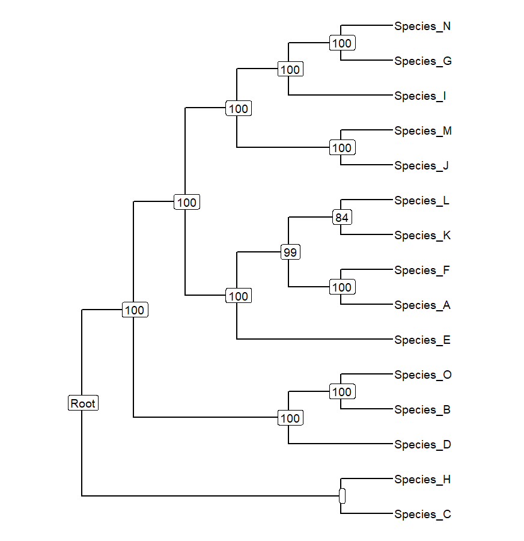

That's better! If you want to adjust the thickness of your branches, you can use the *branch_weight* argument

.. code-block:: r

  treePlotter(myTree,xmin=-1,xmax=8,branch_weight=3)

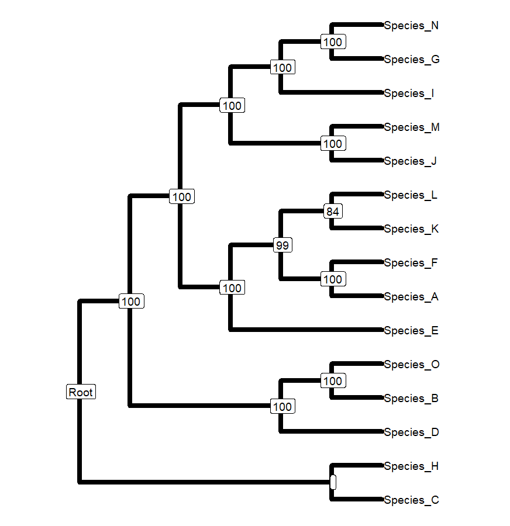

There are a number of options to tweak the tip labels, including: 

  - *taxa_font_size*: Set the font size for the tip labels
  - *taxa_fontface*: Options include 'plain' [default], 'bold','italic', and 'bold.italic'
  - *taxa_offset*: Set tip label away from tree

.. code-block:: r

  treePlotter(myTree,xmin=-1,xmax=8,branch_weight=3,taxa_font_size=6,taxa_fontface = 'bold',taxa_offset = 0.2)

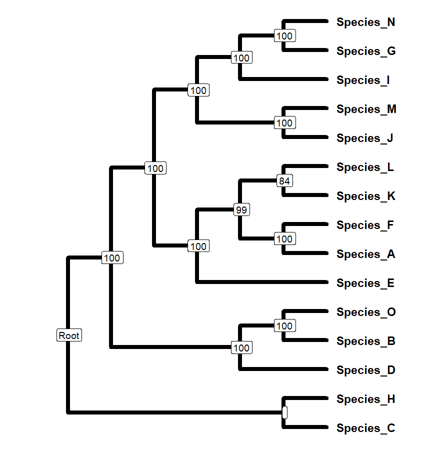

Trees can be plotted with or without branch lengths via the *branch_length* argument. As default, trees are printed as cladograms (*branch_length* = FALSE)

.. code-block:: r

  treePlotter(myTree,branch_length=TRUE,xmax=0.09)

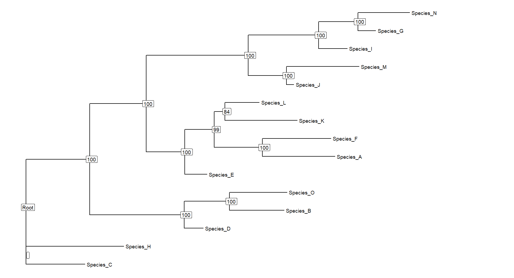
  
Node labels can also be customized. Basic options include:

  - *node_label*: What label to use.
    
    - "bs": Bootstrap [default]
    - "none": No label
    - "node": Print the Node ID (output from getMRCA)
  
  - *node_label_font_size*
  - *node_label_fontface*
  - *node_label_color*
  - *node_label_box*: Print nodel label in a box [Default = TRUE]
  - *node_label_nudge*

  .. code-block:: r
  
    treePlotter(myTree,xmax=8,node_label = 'node',node_label_nudge = 0.05,node_label_box = FALSE)
  
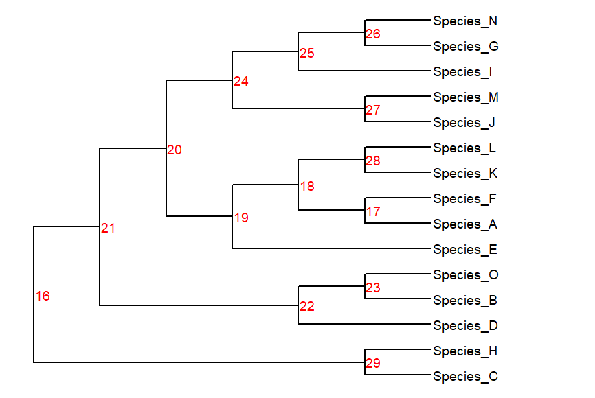

You can highlight specific tip labels or branchs with colors. There are a few ways to specify groups, including a single vector of tips, or a list of different subsets.

.. code-block:: r

  myFavoriteSpecies <- c('Species_N','Species_G','Species_I')
  myWorstSpecies <- c('Species_A','Species_B')

  species_list <- list("Good" = myFavoriteSpecies, "Bad" = myWorstSpecies)

  treePlotter(myTree,xmin=-1,xmax=8,branch_weight=3,taxa_font_size=6,taxa_fontface = 'bold',taxa_offset = 0.2,to_color = myFavoriteSpecies,colors = 'red',color_branches=TRUE)
  treePlotter(myTree,xmin=-1,xmax=8,branch_weight=3,taxa_font_size=6,taxa_fontface = 'bold',taxa_offset = 0.2,to_color = myWorstSpecies,colors = 'blue')
  
  treePlotter(myTree,xmin=-1,xmax=8,branch_weight=3,taxa_font_size=6,taxa_fontface = 'bold',taxa_offset = 0.2,to_color = species_list)
  treePlotter(myTree,xmin=-1,xmax=8,branch_weight=3,taxa_font_size=6,taxa_fontface = 'bold',taxa_offset = 0.2,to_color = species_list,colors = c('green3','pink3'),highlight_legend = TRUE)

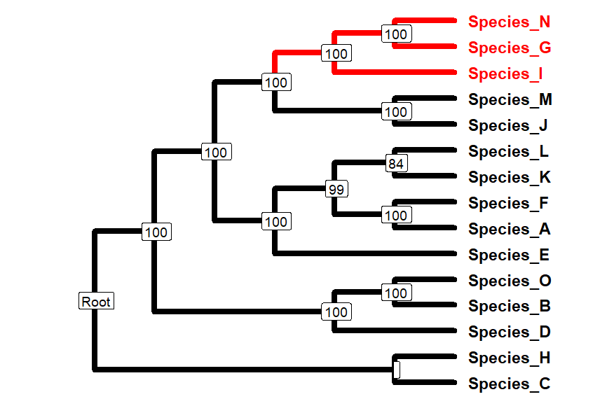

|br|

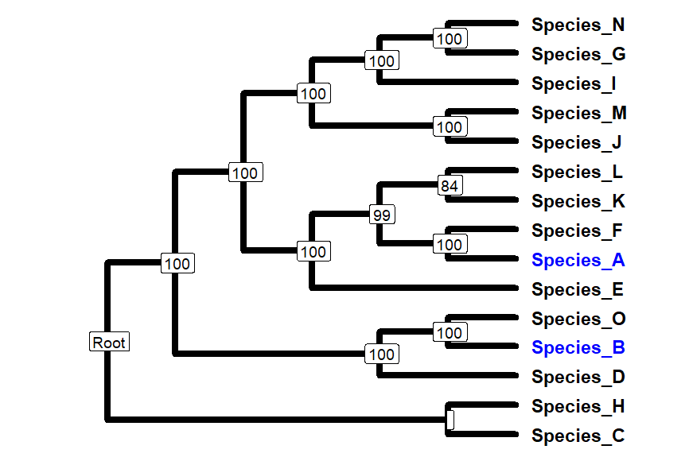

|br|
  
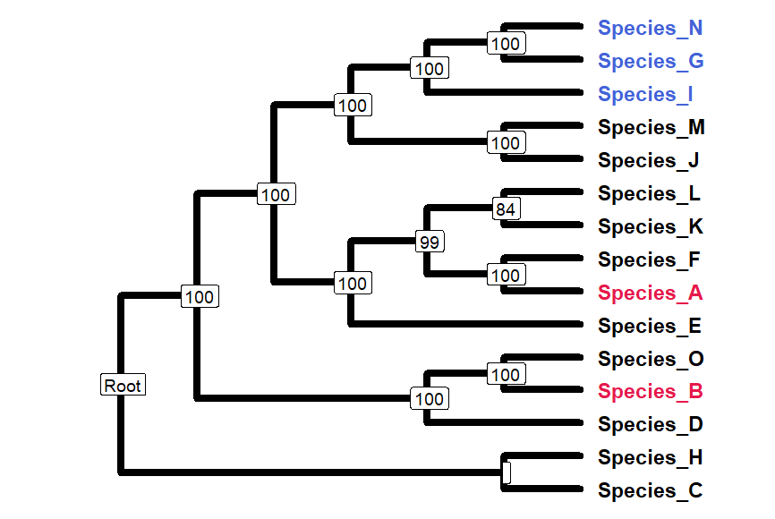

|br|
  
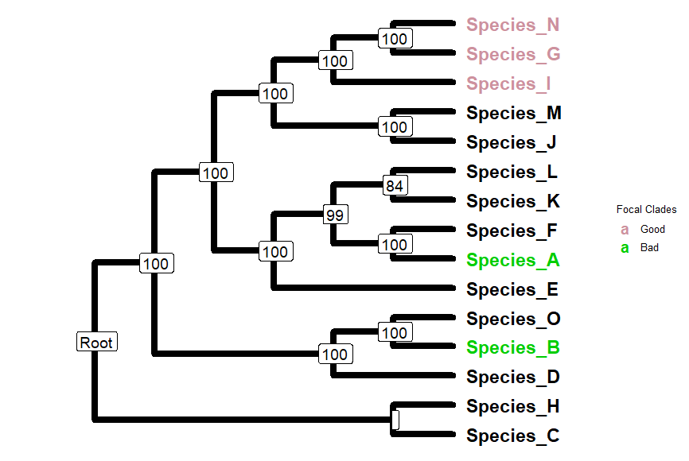
  
Reverse the X-axis using *reverse_x* = TRUE

.. code-block:: r

  plot1 <- treePlotter(myTree,xmin=-1,xmax=8,branch_weight=3,taxa_font_size=6,taxa_fontface = 'bold',taxa_offset = 0.2,to_color = myFavoriteSpecies,colors="red")
  plot2 <- treePlotter(myTree,xmin=-1,xmax=8,branch_weight=3,taxa_font_size=6,taxa_fontface = 'bold',taxa_offset = 0.2,to_color = myWorstSpecies,colors="blue",reverse_x=TRUE)
  tandemPlotter(plot1,plot2)

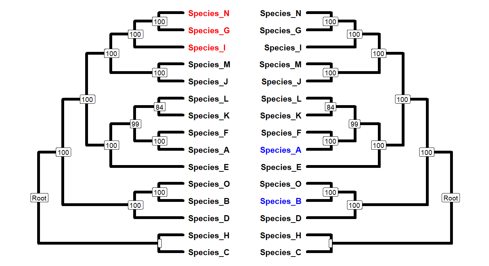

=====================
MultiPhylo Plotting
=====================

**treePlotter** can take mutliPhylo arguments, and can handle them in one of two major ways.

  1. By default, trees from the multiPhylo are first pruned down to a common set of taxa prior to plotting (if necessary)
  2. If *basic_plot* is TRUE, trees are plotted without pre-pruning.
    
    - Under *basic_plot*, options like visualizing clade or alignment support are disabled.
    
.. code-block:: r

  # Read in multiPhylo of trees
  myTrees <- readRooted(rb_unroot_dir,'Species_C;Species_H')

  # Create a tree without Species A or B
  myTrimmedTree <- treeTrimmer(myTree,myWorstSpecies,remove = TRUE)

  # Add trimmed tree to mutliPhylo and rename trees
  myNewTrees <- c(myTrees,myTrimmedTree) %>% treeNamer()

  treePlotter(myTrees,xmin=-1,xmax=8,node_label_font_size = 3,taxa_offset = 0.2,taxa_fontface = "bold",taxa_font_size = 3,to_color=species_list)
  treePlotter(myTrees,xmin=-1,xmax=8,node_label_font_size = 3,taxa_offset = 0.2,taxa_fontface = "bold",taxa_font_size = 3,basic_plot = TRUE)

  treePlotter(myNewTrees,xmin=-1,xmax=8,node_label_font_size = 3,taxa_offset = 0.2,taxa_fontface = "bold",taxa_font_size = 3,to_color=species_list)
  treePlotter(myNewTrees,xmin=-1,xmax=8,node_label_font_size = 3,taxa_offset = 0.2,taxa_fontface = "bold",taxa_font_size = 3,to_color=species_list,basic_plot = TRUE)

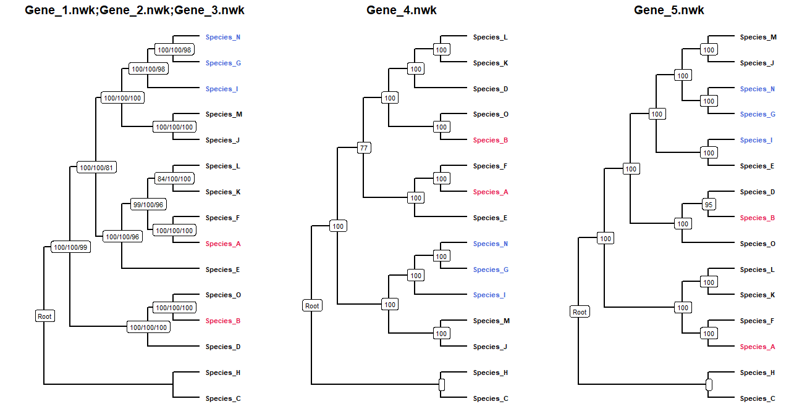

|br|

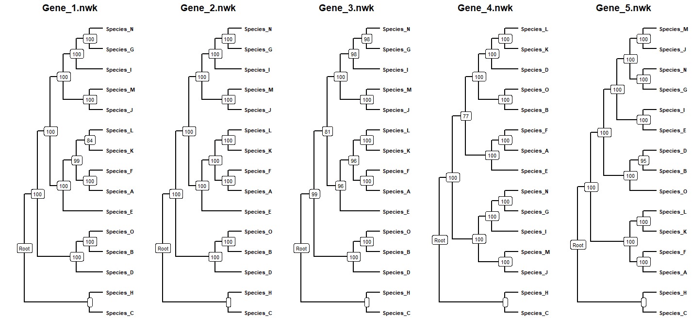

|br|

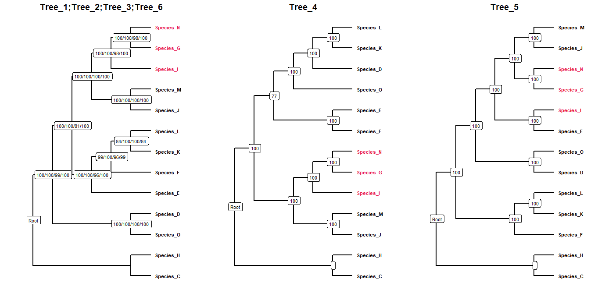

|br|

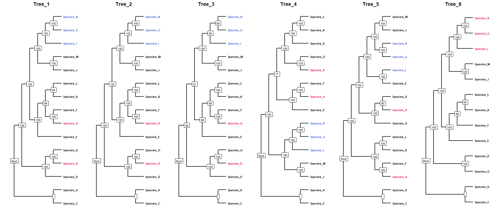

If a multiPhylo contains multiple topologies, you can easily visualize node support with **treePlotter** using the *clade_support* option.

.. code-block:: r

  tree_clades <- getTreeClades(myTrees,return_counts = TRUE)
  treePlotter(myTrees,clade_support = tree_clades, xmin=-1,xmax=8,node_label = 'none',geom_alpha = 1,taxa_offset = 0.2,taxa_fontface = "bold",to_color=species_list,geom_size = 10,legend_shape_size = 10,legend_font_size = 15)

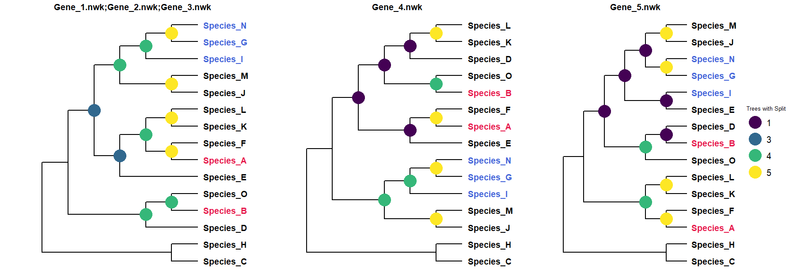

=================================
Plotting Support From Alignments
=================================

If you have multiple sequence alignment data from species in your phylo or multiPhylo object, **treePlotter** allows you to plot node support onto your phylogenies in a number of ways.

.. code-block:: r

  # Get signal from an alignment file, as it relates to species from myTree
  mySignal <- getAlignmentSignal(rb_align1_path,species_info = myTree,alignment_name = "Gene A")

  # Break down support from mySignal as it relates to splits from myTree
  mySupport <- getAlignmentSupport(mySignal,myTree,include_root = TRUE,dataset_name = "Gene A")

  # Plot tree with node labels corresponding to the number of sites supporting each split
  treePlotter(myTree,xmin=-1,xmax=8,branch_weight=3,taxa_font_size=6,taxa_fontface = 'bold',taxa_offset = 0.2,
              tree_support = mySupport,node_label='support',plot_root_support = TRUE)

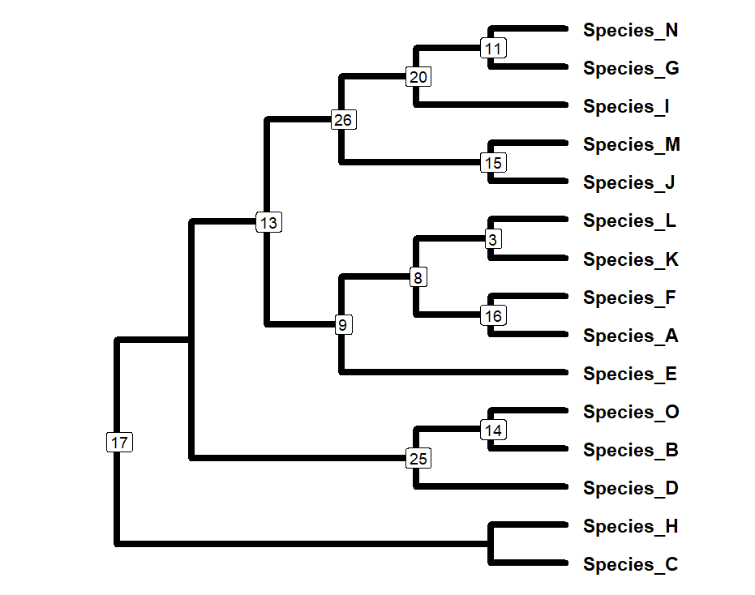

.. code-block:: r

  # Plot tree with node geoms, with sizes scaled to the number of sites supporting each split (rescaled from 5 - 30)
  treePlotter(myTree,xmin=-1,xmax=8,branch_weight=3,taxa_font_size=6,taxa_fontface = 'bold',taxa_offset = 0.2,
              tree_support = mySupport,node_label='support',node_label_nudge = 0.1,plot_root_support = TRUE,geom_size = c(5,30),geom_alpha = 1)

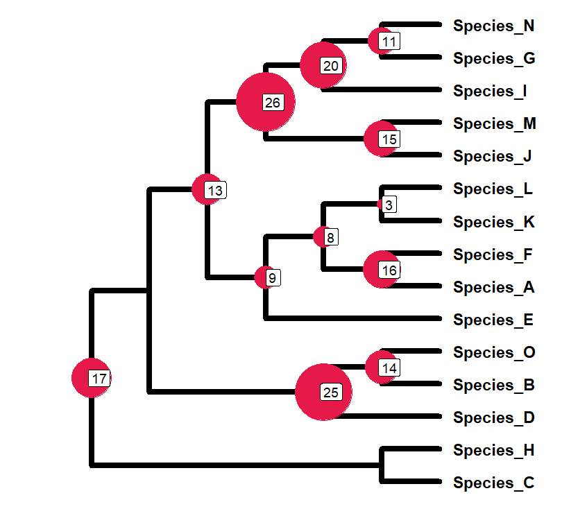

.. code-block:: r

  # Plot support from 2+ multiple sequence alignments onto the phylogeny

  # Get signal from an alignment files, as it relates to species from myTrees
  mySignals <- getAlignmentSignal(rb_alignment_dir,species_info = myTrees,suffix = ".phy",alignment_name = c('Gene_A','Gene_B','Gene_C','Gene_D','Gene_E'))

  # Break down support from mySignals as it relates to splits from myTrees
  mySupports <- getAlignmentSupport(mySignals,myTrees,include_root = TRUE)

  # Plot support values as geoms scaled to the total support summed over all alignments
  treePlotter(myTrees,xmin=-1,xmax=8,branch_weight=3,taxa_font_size=4,taxa_fontface = 'bold',taxa_offset = 0.1,
              tree_support = mySupports,node_label='support',node_label_nudge = 0.1,plot_root_support = TRUE,geom_size = c(5,30),geom_alpha = 1)

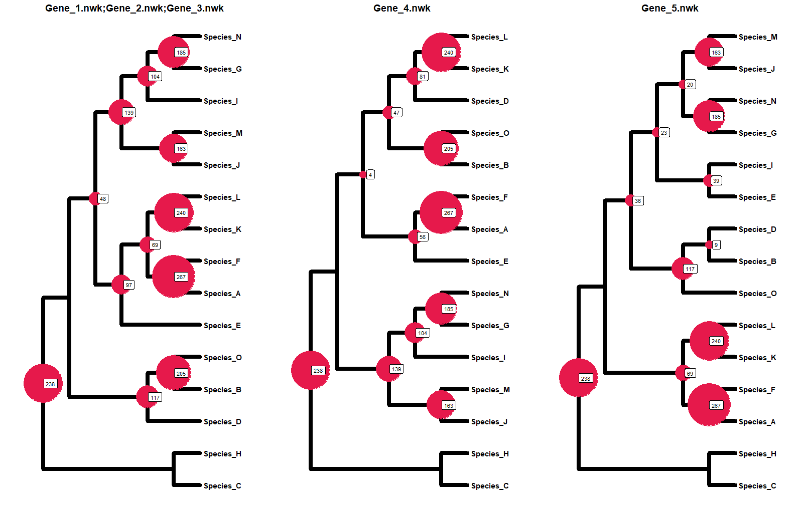

.. code-block:: r

  # Plot support values as pies scaled to the total support summed over all alignments, and color coded by alignment
  # Note when using pies that the position of the legend needs to be set manually
  treePlotter(myTrees,xmin=-1,xmax=8,branch_weight=3,taxa_font_size=4,taxa_fontface = 'bold',taxa_offset = 0.1,
              tree_support = mySupports,use_pies = TRUE,node_label='support',node_label_fontface = "bold",geom_size = 4,node_label_color = "red",node_label_font_size = 3,node_label_nudge = 0.4,plot_root_support = TRUE,geom_alpha = 1,pie_scaler=0.45,pie_colors = c('red','blue','green','orange','purple'),pie_legend_position = c(1,1,14,14),scale_range = c(75,250))
  
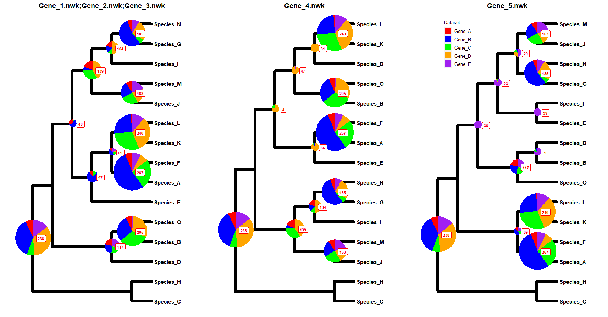

