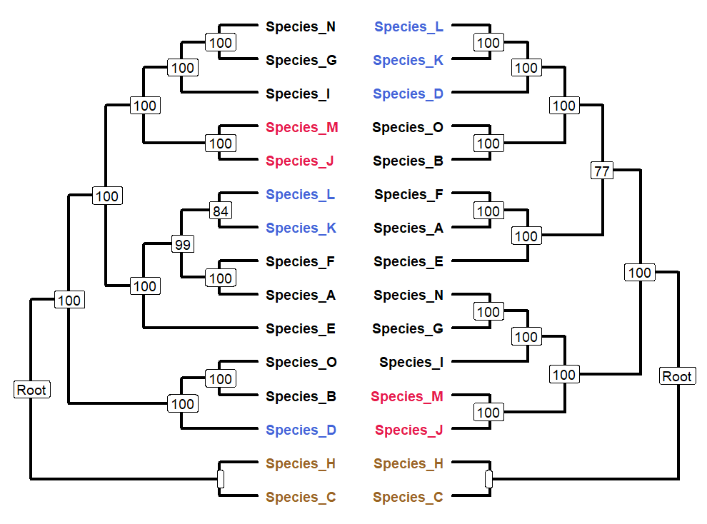

.. _checkTips:

##############
**checkTips**
##############

**checkTips** queries phylo or multiPhylo objects regarding:

  - The presence or absence of tips on the tree
  - Monophyly status of specified tips/clades
  - Root nature of specified tips/clades

=======================
Function and Arguments
=======================

**Usage**:
::

  checkTips <- function(tree,taxa,check_mono,check_root)

===========================      ===============================================================================================================================================================================================================
 Argument                         Description
===========================      ===============================================================================================================================================================================================================
**tree**				                  A phylo object, or a multiPhylo where all trees share 3+ taxa
**taxa**                          Tip labels to query; Can be provided as a vector of IDs, or a semicolon-delimited character
**check_mono**                    If TRUE, check if **taxa** are monophyletic in **tree**. Applies to all trees in a multiPhylo. [Default: FALSE]
**check_root**                    If TRUE, check if **taxa** form one of the two tree root clades. Applies to all trees in a multiPhylo. [Default: FALSE]
===========================      ===============================================================================================================================================================================================================

==============
Example Usage
==============

.. code-block:: r
  
  # Script: Rboretum/docs/content/Doc_Function_Scripts/checkTips.R

  library(Rboretum)
  sourceRboretum()
  
  # Read in two test trees with different topologies
  myTree_1 <- readRooted(rb_tree1_path,root_taxa = c('Species_C','Species_H'))
  myTree_2 <- readRooted(rb_tree4_path,root_taxa = c('Species_C','Species_H'))
  
  # Create mutliPhylo
  myTrees <- c(myTree_1,myTree_2) %>% treeNamer()
  
  # Visualize trees
  
  # Set some clades of interest
  coi_1 <- c('Species_J','Species_M')
  coi_2 <- c('Species_C','Species_H')
  coi_3 <- c('Species_D','Species_K','Species_L')
  coi_list <- list("One"=coi_1,"Two"=coi_2,"Three"=coi_3)

  # Make plots
  plot_1 <- treePlotter(myTree_1,branch_weight = 1.5,xmax=10,to_color = coi_list,taxa_fontface = "bold",taxa_offset = 0.2)
  plot_2 <- treePlotter(myTree_2,branch_weight = 1.5, xmax=10,to_color = coi_list,taxa_fontface = "bold",taxa_offset = 0.2,reverse_x=TRUE)
  tandemPlotter(plot_1,plot_2)
  

.. code-block:: r

  # Check if taxa from Clade of Interest 1 (Species_J/Species_M) are in the trees
  
  checkTips(tree=myTree_1,taxa = coi_1)
  [1] TRUE
  checkTips(tree=myTree_2,taxa = coi_1)
  [1] TRUE
  checkTips(tree=myTrees,taxa = coi_1)
  [1] TRUE

  # Check if nonsense taxa are in the trees
  
  checkTips(tree=myTree_1,taxa = "Not_A_Species")
  [1] FALSE
  checkTips(tree=myTree_2,taxa = "Also_Not_A_Species")
  [1] FALSE

  # Check if taxa from Clade of Interest 1 (Species_J/Species_M) form a monophyletic group
  
  checkTips(tree=myTree_1,taxa = coi_1,check_mono = TRUE)
  [1] TRUE
  checkTips(tree=myTree_2,taxa = coi_1,check_mono = TRUE)
  [1] TRUE
  checkTips(tree=myTrees,taxa = coi_1,check_mono = TRUE)
  [1] TRUE

  # Check if taxa from Clade of Interest 1 (Species_J/Species_M) form a monophyletic group at the root of the tree
  
  checkTips(tree=myTree_1,taxa = coi_1,check_mono = TRUE, check_root=TRUE)
  [1] FALSE
  checkTips(tree=myTree_2,taxa = coi_1,check_mono = TRUE, check_root=TRUE)
  [1] FALSE
  checkTips(tree=myTrees,taxa = coi_1,check_mono = TRUE, check_root=TRUE)
  [1] FALSE

  # Check if taxa from Clade of Interest 2 (Species_C/Species_H) form a monophyletic group at the root of the tree
  
  checkTips(tree=myTree_1,taxa = coi_2,check_mono = TRUE, check_root=TRUE)
  [1] TRUE
  checkTips(tree=myTree_2,taxa = coi_2,check_mono = TRUE, check_root=TRUE)
  [1] TRUE
  checkTips(tree=myTrees,taxa = coi_2,check_mono = TRUE, check_root=TRUE)
  [1] TRUE

  # Check if taxa from Clade of Interest 3 (Species_D/Species_K/Species_L)form a monophyletic group
  
  checkTips(tree=myTree_1,taxa = coi_3,check_mono = TRUE)
  [1] FALSE
  checkTips(tree=myTree_2,taxa = coi_3,check_mono = TRUE)
  [1] TRUE
  checkTips(tree=myTrees,taxa = coi_3,check_mono = TRUE)
  [1] FALSE
